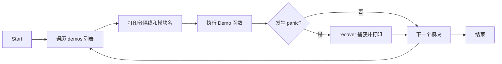

# 技术设计文档：go-basics-demo

## 概述

`go-basics-demo` 是一个面向有 C 语言基础的开发者的 Go 语言入门示例项目。项目通过 14 个独立的演示模块，系统地展示 Go 语言的核心概念，并在每个模块中通过注释与 C 语言进行对比说明。

项目的核心设计原则：
- 每个模块是一个独立的 Go 包，可单独理解和运行
- 主程序按顺序调用所有模块，提供完整的学习路径
- 每个模块包含可运行的代码示例、详细注释和 C 语言对比
- 所有模块均有对应的测试文件，演示 Go 测试最佳实践

---

## 架构

### 整体架构

```mermaid
graph TD
    A[main.go - 入口] --> B[Runner]
    B --> C[demos/variables]
    B --> D[demos/controlflow]
    B --> E[demos/functions]
    B --> F[demos/collections]
    B --> G[demos/structs]
    B --> H[demos/interfaces]
    B --> I[demos/errors]
    B --> J[demos/concurrency]
    B --> K[demos/pointers]
    B --> L[demos/packages]
    B --> M[demos/generics]
    B --> N[demos/testing_demo]
    B --> O[demos/stdlib]
    B --> P[demos/controlflow - type switch]

    subgraph "每个 demo 包"
        Q[Demo() 函数] --> R[示例代码]
        R --> S[fmt.Println 输出]
    end
```

### 项目目录结构

```
go-basics-demo/
├── go.mod                    # module: go-basics-demo, go 1.21
├── go.sum                    # 依赖校验文件
├── main.go                   # 唯一入口，Runner 逻辑
├── README.md                 # 项目说明与学习顺序
└── demos/
    ├── variables/
    │   ├── variables.go      # 变量与基本类型演示
    │   └── variables_test.go # 测试文件
    ├── controlflow/
    │   ├── controlflow.go
    │   └── controlflow_test.go
    ├── functions/
    │   ├── functions.go
    │   └── functions_test.go
    ├── collections/
    │   ├── collections.go    # 数组、切片、Map
    │   └── collections_test.go
    ├── structs/
    │   ├── structs.go        # 结构体与方法
    │   └── structs_test.go
    ├── interfaces/
    │   ├── interfaces.go
    │   └── interfaces_test.go
    ├── errors/
    │   ├── errors.go
    │   └── errors_test.go
    ├── concurrency/
    │   ├── concurrency.go
    │   └── concurrency_test.go
    ├── pointers/
    │   ├── pointers.go
    │   └── pointers_test.go
    ├── packages/
    │   ├── packages.go
    │   └── packages_test.go
    ├── generics/
    │   ├── generics.go
    │   └── generics_test.go
    ├── testing_demo/
    │   ├── testing_demo.go
    │   └── testing_demo_test.go
    └── stdlib/
        ├── stdlib.go
        └── stdlib_test.go
```

### Runner 设计

`main.go` 中的 Runner 使用函数切片存储所有模块的演示函数，按顺序执行，并用 `recover` 捕获每个模块可能的 panic：



---

## 组件与接口

### 核心接口：DemoModule

每个演示模块对外暴露一个 `Demo()` 函数，签名统一为：

```go
// 每个 demos/* 包均导出此函数
func Demo()
```

Runner 通过函数切片调用：

```go
type demoEntry struct {
    name string
    fn   func()
}
```

### 模块接口设计

#### demos/variables
- `Demo()` — 演示所有变量与类型相关内容

#### demos/controlflow
- `Demo()` — 演示控制流语句
- `TypeSwitchDemo(i interface{}) string` — 供测试调用的类型判断函数

#### demos/functions
- `Demo()` — 演示函数特性
- `Sum(nums ...int) int` — 可变参数求和（供测试）
- `MakeAdder(x int) func(int) int` — 返回闭包（供测试）
- `SafeDivide(a, b int) (result int, err error)` — 演示 defer+recover（供测试）

#### demos/collections
- `Demo()` — 演示集合类型
- `Filter[T any](s []T, f func(T) bool) []T` — 泛型过滤（供测试，Go 1.21+）
- `MapSlice[T, U any](s []T, f func(T) U) []U` — 泛型映射（供测试）

#### demos/structs
- `Demo()` — 演示结构体与方法
- `type Animal struct` — 基础结构体
- `type Dog struct` — 嵌入 Animal 的结构体

#### demos/interfaces
- `Demo()` — 演示接口
- `type Shape interface { Area() float64; Perimeter() float64 }` — 示例接口
- `type Circle struct`、`type Rectangle struct` — 实现 Shape

#### demos/errors
- `Demo()` — 演示错误处理
- `Divide(a, b float64) (float64, error)` — 返回 error（供测试）
- `type ValidationError struct` — 自定义错误类型
- `var ErrNotFound = errors.New("not found")` — 哨兵错误

#### demos/concurrency
- `Demo()` — 演示并发
- `MergeChannels[T any](cs ...<-chan T) <-chan T` — channel 合并（供测试）

#### demos/pointers
- `Demo()` — 演示指针
- `Increment(p *int)` — 通过指针修改值（供测试）

#### demos/generics
- `Demo()` — 演示泛型
- `type Stack[T any] struct` — 泛型栈
- `Map[T, U any](s []T, f func(T) U) []U` — 泛型 Map 函数
- `Filter[T any](s []T, f func(T) bool) []T` — 泛型 Filter 函数
- `Contains[T comparable](s []T, v T) bool` — 泛型包含检查

#### demos/stdlib
- `Demo()` — 演示标准库
- `FormatTime(t time.Time) string` — 时间格式化（供测试）
- `CountWords(s string) int` — 字符串处理（供测试）

---

## 数据模型

### 模块注册表

```go
// main.go
type demoEntry struct {
    name string      // 模块显示名称，如 "变量与基本类型"
    fn   func()      // 演示函数
}

var demos = []demoEntry{
    {"1. 变量与基本类型", variables.Demo},
    {"2. 控制流",        controlflow.Demo},
    {"3. 函数",          functions.Demo},
    {"4. 数组、切片与Map", collections.Demo},
    {"5. 结构体与方法",   structs.Demo},
    {"6. 接口",          interfaces.Demo},
    {"7. 错误处理",       errors_demo.Demo},
    {"8. 并发",          concurrency.Demo},
    {"9. 指针",          pointers.Demo},
    {"10. 包与模块",      packages.Demo},
    {"11. 泛型",         generics.Demo},
    {"12. 测试",         testing_demo.Demo},
    {"13. 标准库常用包",  stdlib.Demo},
}
```

### 各模块关键数据结构

#### structs 模块

```go
// Animal 基础结构体，演示值类型、方法、标签
type Animal struct {
    Name    string `json:"name"`
    Age     int    `json:"age"`
    Species string `json:"species,omitempty"`
}

func (a Animal) String() string          // 值接收者
func (a *Animal) Birthday()              // 指针接收者，修改 Age

// Dog 演示嵌入（匿名字段）与方法提升
type Dog struct {
    Animal                               // 嵌入，提升 Animal 的方法
    Breed string `json:"breed"`
}
```

#### interfaces 模块

```go
type Shape interface {
    Area() float64
    Perimeter() float64
}

type Stringer interface {
    String() string
}

// Circle 和 Rectangle 均实现 Shape
type Circle struct { Radius float64 }
type Rectangle struct { Width, Height float64 }
```

#### errors 模块

```go
// 哨兵错误
var ErrNotFound = errors.New("not found")
var ErrDivisionByZero = errors.New("division by zero")

// 自定义错误类型
type ValidationError struct {
    Field   string
    Message string
}
func (e *ValidationError) Error() string
```

#### generics 模块

```go
// 泛型栈
type Stack[T any] struct {
    items []T
}
func (s *Stack[T]) Push(item T)
func (s *Stack[T]) Pop() (T, bool)
func (s *Stack[T]) Peek() (T, bool)
func (s *Stack[T]) Len() int
func (s *Stack[T]) IsEmpty() bool

// 数值约束
type Number interface {
    ~int | ~int8 | ~int16 | ~int32 | ~int64 |
    ~float32 | ~float64
}

func Sum[T Number](s []T) T
func Map[T, U any](s []T, f func(T) U) []U
func Filter[T any](s []T, f func(T) bool) []T
func Contains[T comparable](s []T, v T) bool
```

#### concurrency 模块

```go
// Worker Pool 演示
type Job struct {
    ID    int
    Input int
}
type Result struct {
    Job    Job
    Output int
}
```

---

## 正确性属性

*属性（Property）是在系统所有有效执行中都应成立的特征或行为——本质上是对系统应该做什么的形式化陈述。属性是人类可读规范与机器可验证正确性保证之间的桥梁。*


### 属性 1：Runner panic 恢复

*对于任意*会触发 panic 的演示函数，Runner 的 `runSafe` 包装函数执行后不应将 panic 传播到调用方，且后续的演示函数仍应被正常调用。

**验证需求：1.7**

---

### 属性 2：Go 零值机制

*对于任意*基本类型（int、float64、bool、string）的变量，在声明但未赋值时，其值应等于该类型的零值（0、0.0、false、""）。

**验证需求：2.3**

---

### 属性 3：字符串与 []byte 互转 round-trip

*对于任意*字节切片 `b`，执行 `[]byte(string(b))` 后应得到与原始 `b` 内容相同的字节切片；反之，*对于任意*字符串 `s`，执行 `string([]byte(s))` 后应得到与原始 `s` 相同的字符串。

**验证需求：2.9**

---

### 属性 4：range 遍历完整性

*对于任意*切片 `s`，使用 `range` 遍历得到的所有 `(index, value)` 对，其 index 应覆盖 `[0, len(s))` 的每个整数恰好一次，且每个 value 应等于 `s[index]`。

**验证需求：3.7**

---

### 属性 5：可变参数求和

*对于任意*整数切片，`Sum(nums...)` 的返回值应等于切片中所有元素的算术和；特别地，空切片的求和结果为 0。

**验证需求：4.4**

---

### 属性 6：闭包加法器正确性

*对于任意*整数 `x` 和 `y`，`MakeAdder(x)(y)` 应返回 `x + y`。

**验证需求：4.7**

---

### 属性 7：defer LIFO 执行顺序

*对于任意*数量的 defer 注册操作，它们的实际执行顺序应是注册顺序的严格逆序（后进先出）。

**验证需求：4.8**

---

### 属性 8：数组值类型语义

*对于任意*数组 `a` 和对其副本的任意修改操作，原数组 `a` 的内容应保持不变。

**验证需求：5.2**

---

### 属性 9：切片 append 正确性

*对于任意*切片 `s` 和元素 `v`，`append(s, v)` 的结果长度应等于 `len(s) + 1`，且结果的最后一个元素应等于 `v`，前 `len(s)` 个元素应与原切片相同。

**验证需求：5.4**

---

### 属性 10：copy 函数正确性

*对于任意*源切片 `src` 和目标切片 `dst`，`copy(dst, src)` 执行后，`dst` 的前 `min(len(dst), len(src))` 个元素应等于 `src` 对应位置的元素，且 `src` 的内容不应被修改。

**验证需求：5.7**

---

### 属性 11：map 读写 round-trip

*对于任意*键 `k` 和值 `v`，将 `v` 写入 map 后，读取键 `k` 应得到相同的值 `v`，且存在性检查 `ok` 应为 `true`；删除键 `k` 后，存在性检查 `ok` 应为 `false`。

**验证需求：5.10**

---

### 属性 12：指针接收者方法修改原始值

*对于任意*结构体实例，通过指针接收者方法对其字段进行修改后，原始结构体实例的对应字段应反映该修改。

**验证需求：6.3, 6.4**

---

### 属性 13：接口多态正确性

*对于任意*实现了 `Shape` 接口的具体类型（Circle、Rectangle），通过接口变量调用 `Area()` 和 `Perimeter()` 应返回与直接调用具体类型方法相同的结果。

**验证需求：7.3**

---

### 属性 14：类型断言 round-trip

*对于任意*具体类型值 `v`，将其赋给接口变量 `i`，再通过类型断言 `i.(ConcreteType)` 提取，应得到与原始值 `v` 相等的值，且 `ok` 为 `true`。

**验证需求：7.6**

---

### 属性 15：错误处理正确性

*对于任意*有效输入，`Divide(a, b)` 当 `b != 0` 时应返回正确的商且 `error` 为 `nil`；当 `b == 0` 时应返回零值且 `error` 非 `nil`。

**验证需求：8.2**

---

### 属性 16：错误链操作正确性

*对于任意*错误值 `target`，使用 `fmt.Errorf("%w", target)` 包装后，`errors.Is(wrapped, target)` 应返回 `true`；对于任意自定义错误类型，使用 `%w` 包装后，`errors.As(wrapped, &target)` 应能成功提取出原始错误类型。

**验证需求：8.6, 8.7**

---

### 属性 17：channel 数据传输 round-trip

*对于任意*可发送的值 `v`，通过 channel 发送后接收，应得到与 `v` 相等的值，且数据不应丢失或损坏。

**验证需求：9.2**

---

### 属性 18：并发计数器安全性

*对于任意*数量的 goroutine 并发地对共享计数器执行固定次数的递增操作，使用 `sync.Mutex` 保护后，最终计数器的值应等于所有 goroutine 递增次数的总和。

**验证需求：9.8**

---

### 属性 19：指针取地址与解引用 round-trip

*对于任意*变量 `x`，`*(&x)` 应等于 `x`；通过指针修改值后，原变量应反映该修改。

**验证需求：10.1, 10.2**

---

### 属性 20：泛型 Map 函数正确性

*对于任意*切片 `s` 和函数 `f`，`Map(s, f)` 的结果长度应等于 `len(s)`，且结果的第 `i` 个元素应等于 `f(s[i])`。

**验证需求：12.1**

---

### 属性 21：泛型 Stack LIFO 语义

*对于任意*类型 `T` 和任意序列的 Push 操作，Pop 操作应以严格的后进先出顺序返回元素；空栈的 Pop 应返回零值和 `false`。

**验证需求：12.4**

---

### 属性 22：strings.Split/Join round-trip

*对于任意*不包含分隔符 `sep` 的字符串切片 `parts`，`strings.Split(strings.Join(parts, sep), sep)` 应返回与 `parts` 内容相同的切片。

**验证需求：14.2**

---

### 属性 23：strconv 数值字符串互转 round-trip

*对于任意*整数 `n`，`strconv.Atoi(strconv.Itoa(n))` 应返回 `n` 且 `error` 为 `nil`；*对于任意*有效整数字符串 `s`，`strconv.Itoa(atoi(s))` 应返回 `s`。

**验证需求：14.3**

---

### 属性 24：时间格式化 round-trip

*对于任意*时间值 `t`（精确到秒），使用 Go 参考时间格式 `"2006-01-02 15:04:05"` 格式化后再解析，应得到与原始时间相等的时间值。

**验证需求：14.8**

---

## 错误处理

### 全局 panic 恢复策略

Runner 在 `main.go` 中为每个模块的调用包装 `recover`：

```go
func runSafe(name string, fn func()) {
    defer func() {
        if r := recover(); r != nil {
            fmt.Printf("[PANIC in %s]: %v\n", name, r)
        }
    }()
    fn()
}
```

### 各模块错误处理原则

| 模块 | 错误类型 | 处理方式 |
|------|---------|---------|
| variables | nil 指针解引用 | 由 Runner 的 recover 捕获，演示 panic |
| collections | nil map 写入、越界访问 | 由 Runner 的 recover 捕获，演示 panic |
| errors | 除零、未找到 | 返回 error，演示错误处理模式 |
| concurrency | goroutine 泄漏 | 通过 context 取消或 channel 关闭避免 |
| stdlib | 文件不存在、网络错误 | 检查 error，打印错误信息后继续 |

### 演示性 panic 的处理

部分模块（variables、collections）会故意触发 panic 来演示语言行为。这些 panic 由 Runner 的 `runSafe` 函数捕获，不会中断整个程序的执行。

---

## 测试策略

### 双重测试方法

本项目采用单元测试和属性测试相结合的方式：

- **单元测试**：验证具体示例、边界条件和错误情况
- **属性测试**：验证对所有输入都成立的通用属性

两者互补，共同提供全面的测试覆盖。

### 属性测试配置

- 使用 [`pgregory.net/rapid`](https://github.com/flyingmutant/rapid) 作为 Go 的属性测试库
- 每个属性测试最少运行 **100 次迭代**
- 每个属性测试必须通过注释引用设计文档中的属性编号
- 标签格式：`// Feature: go-basics-demo, Property N: <属性描述>`

### 单元测试重点

单元测试应聚焦于：
- 具体的示例验证（如特定输入的预期输出）
- 边界条件（空切片、零值、nil 等）
- 错误条件（无效输入、nil map 写入等）
- 集成点（模块间的交互）

避免为每个可能的输入编写单独的单元测试——属性测试已经覆盖了大量输入的情况。

### 各模块测试文件规划

| 模块 | 单元测试重点 | 属性测试（对应属性编号） |
|------|------------|----------------------|
| variables | 零值示例、类型转换示例 | 属性 2、3 |
| controlflow | range 遍历示例 | 属性 4 |
| functions | defer 顺序示例、闭包示例 | 属性 5、6、7 |
| collections | append/copy/map 示例 | 属性 8、9、10、11 |
| structs | 值类型/指针接收者示例 | 属性 12 |
| interfaces | 多态示例、类型断言示例 | 属性 13、14 |
| errors | 错误处理示例 | 属性 15、16 |
| concurrency | channel/mutex 示例 | 属性 17、18 |
| pointers | 指针操作示例 | 属性 19 |
| generics | 泛型函数/结构体示例 | 属性 20、21 |
| stdlib | 字符串/数值/时间示例 | 属性 22、23、24 |

### 运行测试

```bash
# 运行所有测试
go test ./...

# 运行基准测试
go test -bench=. ./...

# 运行属性测试（增加迭代次数）
go test -rapid.checks=500 ./...

# 查看测试覆盖率
go test -cover ./...
```

### 属性测试示例代码结构

```go
// Feature: go-basics-demo, Property 9: 切片 append 正确性
func TestAppendProperty(t *testing.T) {
    rapid.Check(t, func(t *rapid.T) {
        s := rapid.SliceOf(rapid.Int()).Draw(t, "s")
        v := rapid.Int().Draw(t, "v")
        
        result := append(s, v)
        
        // 长度增加 1
        if len(result) != len(s)+1 {
            t.Fatalf("expected len %d, got %d", len(s)+1, len(result))
        }
        // 最后一个元素等于追加的元素
        if result[len(result)-1] != v {
            t.Fatalf("expected last element %d, got %d", v, result[len(result)-1])
        }
    })
}
```
